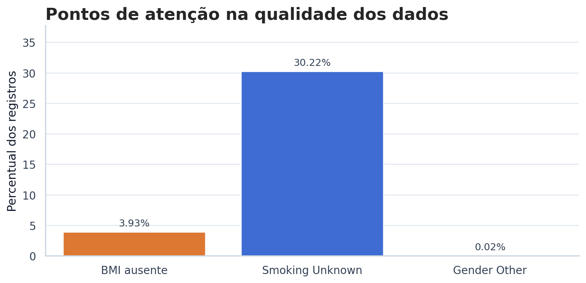
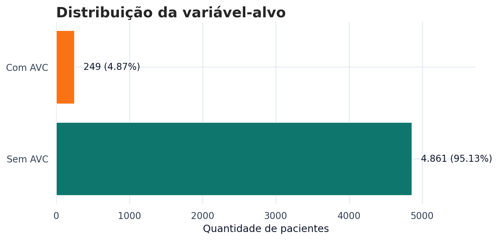
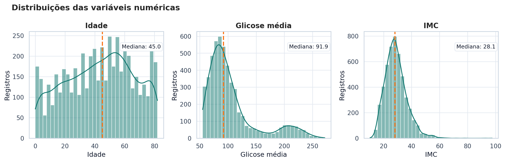
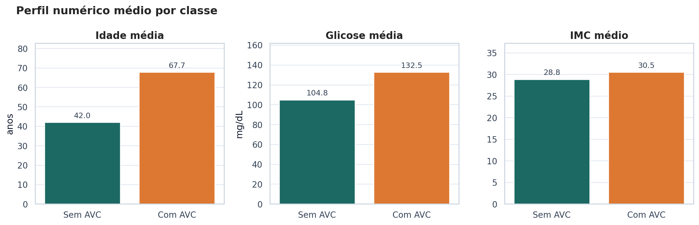
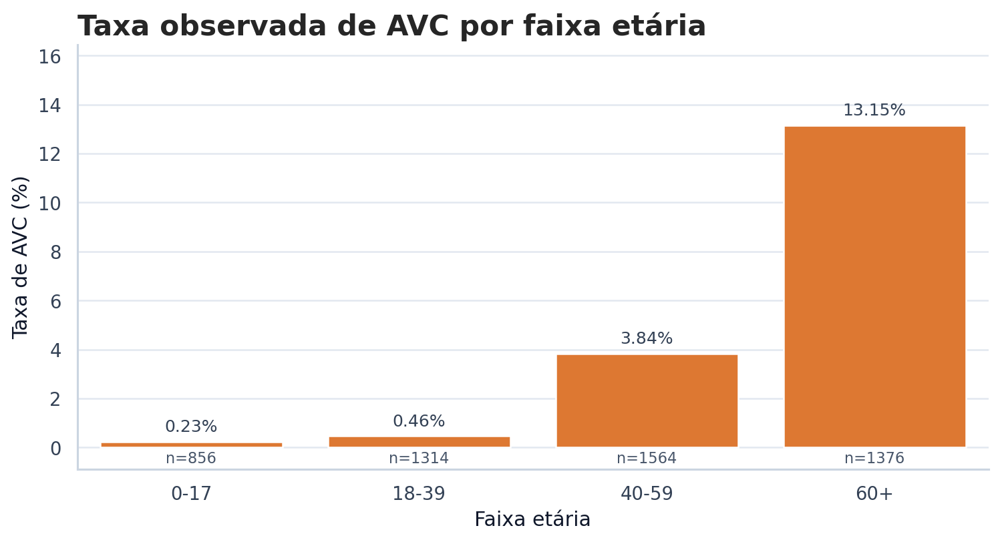
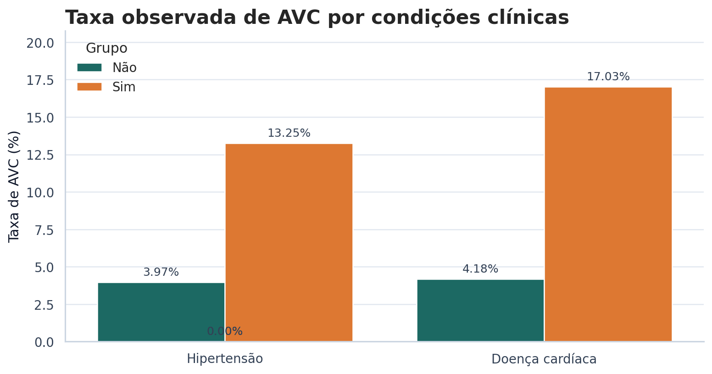
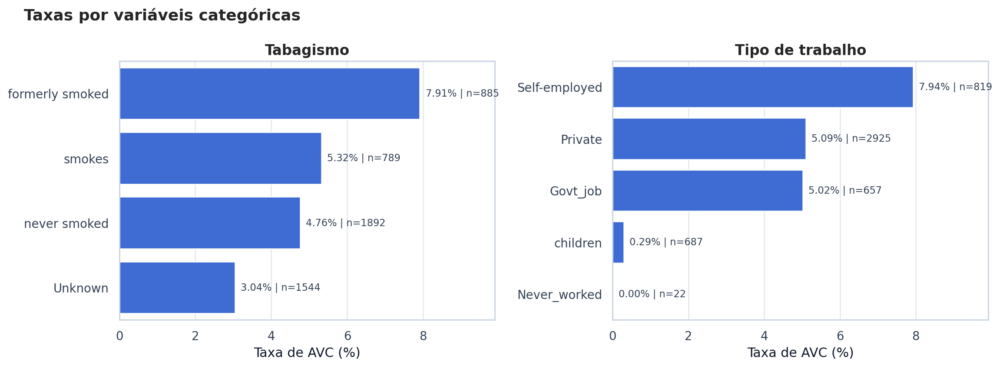
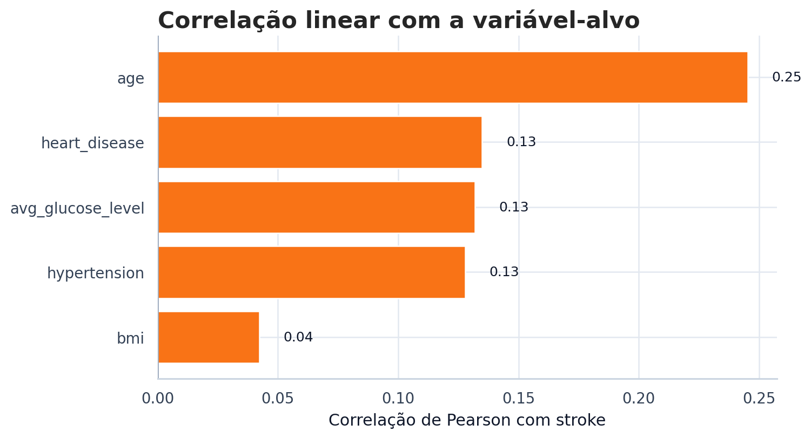
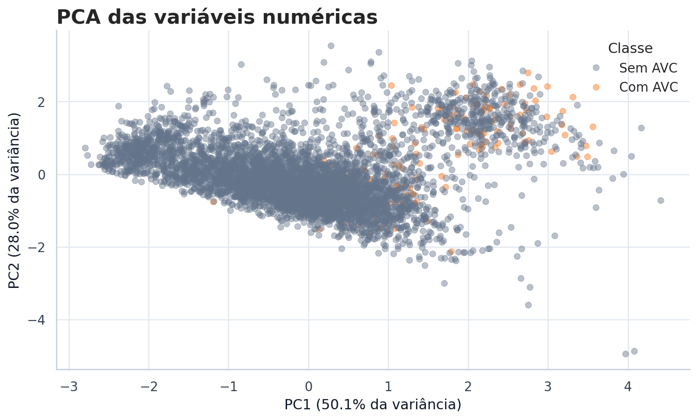

# Análise Exploratória

## Objetivo da EDA

A análise exploratória foi conduzida para entender a estrutura do **Stroke Prediction Dataset**, avaliar a qualidade dos dados e identificar padrões associados à ocorrência de AVC. Nesta etapa, o objetivo não é provar causalidade, mas levantar evidências, limitações e decisões necessárias antes da modelagem.

!!! abstract "Perguntas norteadoras"
    A EDA foi organizada em torno de quatro perguntas: como a base está estruturada, quais problemas de qualidade existem, quais variáveis parecem se associar ao AVC e quais cuidados serão necessários em uma futura etapa de classificação.

## 1. Carregamento e Inspeção Inicial

O arquivo original possui **5.110 registros** e **12 colunas**, incluindo o identificador `id` e a variável-alvo `stroke`. A coluna `id` serve apenas para identificar pacientes e não carrega informação clínica relevante para predição; por isso, deve ser removida antes de qualquer modelo.

| Item verificado | Resultado |
|---|---:|
| Registros | 5.110 |
| Colunas no CSV | 12 |
| Atributos preditivos originais | 11 |
| Variável-alvo | `stroke` |
| Tipo de problema | Classificação binária |

Essa etapa também confirmou a presença de variáveis numéricas, categóricas e binárias, o que exige um pipeline de pré-processamento com estratégias diferentes para cada tipo de dado.

## 2. Tipos das Variáveis

As colunas foram separadas por papel analítico para facilitar a interpretação e a preparação futura dos dados.

| Grupo | Variáveis | Como foram analisadas |
|---|---|---|
| Numéricas contínuas | `age`, `avg_glucose_level`, `bmi` | Estatísticas descritivas, distribuições, correlação e PCA |
| Binárias clínicas | `hypertension`, `heart_disease` | Taxas de AVC por grupo |
| Categóricas | `gender`, `ever_married`, `work_type`, `Residence_type`, `smoking_status` | Frequências e taxa observada de AVC por categoria |
| Alvo | `stroke` | Distribuição das classes e desbalanceamento |

Essa separação é importante porque variáveis numéricas podem ser padronizadas, enquanto variáveis categóricas precisam ser transformadas em colunas numéricas, por exemplo com One-Hot Encoding.

## 3. Valores Ausentes e Inconsistências

A principal ausência explícita aparece em `bmi`, com **201 registros sem valor**, o que representa **3,93%** da base. Também existe uma quantidade relevante de `Unknown` em `smoking_status`: são **1.544 registros**, ou **30,22%** do dataset.

<figure markdown>

<figcaption>Resumo visual dos principais pontos de qualidade encontrados no dataset.</figcaption>
</figure>

Pontos importantes observados:

- `bmi` ausente precisa de tratamento antes da modelagem, como imputação pela mediana ou análise separada dos casos sem valor.
- `smoking_status = Unknown` não deve ser automaticamente tratado como `NaN`, pois é uma categoria presente no dataset, mas representa limitação interpretativa.
- `gender = Other` aparece em apenas 1 registro, então qualquer conclusão sobre essa categoria seria estatisticamente frágil.
- Não foram observadas idades fora de uma faixa plausível nem glicose menor ou igual a zero.

!!! warning "Cuidado de interpretação"
    Ausência de dados e categorias pouco representadas podem distorcer taxas por grupo. Por isso, as análises abaixo sempre consideram tanto a porcentagem quanto o tamanho da amostra.

## 4. Distribuição da Variável-Alvo

A variável-alvo `stroke` é fortemente desbalanceada. Apenas **249 pacientes** tiveram AVC, enquanto **4.861 pacientes** não tiveram.

<figure markdown>

<figcaption>A classe positiva representa apenas 4,87% da base, o que torna a avaliação por acurácia insuficiente.</figcaption>
</figure>

| Classe | Quantidade | Proporção |
|---|---:|---:|
| `stroke = 0` | 4.861 | 95,13% |
| `stroke = 1` | 249 | 4,87% |

Esse ponto é central para o projeto. Em uma base tão desbalanceada, um modelo que prevê quase sempre a classe `0` pode parecer bom pela acurácia, mas falhar justamente no grupo mais importante: pacientes com AVC.

## 5. Análise Univariada

Na análise univariada, as variáveis numéricas foram observadas individualmente. Essa etapa ajuda a entender escala, dispersão, assimetria e possíveis outliers.

<figure markdown>

<figcaption>Distribuições das principais variáveis numéricas usadas na análise.</figcaption>
</figure>

Leitura das distribuições:

- `age` apresenta ampla variação, com pacientes de diferentes faixas etárias.
- `avg_glucose_level` tem assimetria à direita, indicando pacientes com glicose média bastante elevada.
- `bmi` tem valores extremos, com máximo observado de 97,6, então deve receber atenção em etapas de tratamento de outliers.

## 6. Comparação Numérica por Classe

Ao comparar médias entre pacientes com e sem AVC, a diferença mais forte aparece em `age`. Pacientes com AVC têm idade média de **67,73 anos**, enquanto o grupo sem AVC tem média de **41,97 anos**.

<figure markdown>

<figcaption>Comparação das médias de idade, glicose e IMC entre pacientes com e sem AVC.</figcaption>
</figure>

| Variável | Média sem AVC | Média com AVC | Leitura |
|---|---:|---:|---|
| `age` | 41,97 | 67,73 | Maior diferença entre os grupos |
| `avg_glucose_level` | 104,80 | 132,54 | Grupo com AVC apresenta glicose média mais alta |
| `bmi` | 28,82 | 30,47 | Diferença menor, mas ainda observável |

Essas diferenças não significam causalidade, mas indicam que idade e glicose média são variáveis relevantes para investigação posterior.

## 7. Idade e Taxa de AVC

Para deixar a relação com idade mais clara, a base foi agrupada em faixas etárias. A taxa observada de AVC cresce bastante no grupo de pacientes com **60 anos ou mais**.

<figure markdown>

<figcaption>A taxa observada de AVC aumenta nas faixas etárias mais altas, especialmente no grupo 60+.</figcaption>
</figure>

| Faixa etária | Pacientes | Casos de AVC | Taxa observada |
|---|---:|---:|---:|
| 0-17 | 856 | 2 | 0,23% |
| 18-39 | 1.314 | 6 | 0,46% |
| 40-59 | 1.564 | 60 | 3,84% |
| 60+ | 1.376 | 181 | 13,15% |

!!! success "Insight principal"
    A idade é o sinal mais consistente da EDA. Ela aparece com diferença clara entre classes, maior correlação com `stroke` e crescimento visível da taxa de AVC nas faixas etárias mais altas.

## 8. Condições Clínicas

As variáveis `hypertension` e `heart_disease` também apresentaram diferenças relevantes nas taxas observadas de AVC.

<figure markdown>

<figcaption>Pacientes com hipertensão ou doença cardíaca apresentam taxas observadas de AVC maiores no dataset.</figcaption>
</figure>

### Hipertensão

| Hipertensão | Pacientes | Casos de AVC | Taxa observada |
|---|---:|---:|---:|
| Não | 4.612 | 183 | 3,97% |
| Sim | 498 | 66 | 13,25% |

### Doença Cardíaca

| Doença cardíaca | Pacientes | Casos de AVC | Taxa observada |
|---|---:|---:|---:|
| Não | 4.834 | 202 | 4,18% |
| Sim | 276 | 47 | 17,03% |

Esses resultados sugerem que condições clínicas prévias podem ajudar a separar perfis de risco. Ainda assim, como a EDA é observacional, essas relações devem ser interpretadas como associação, não como prova causal.

## 9. Variáveis Categóricas

As variáveis categóricas foram analisadas por taxa observada de AVC em cada grupo. Duas leituras exigem cuidado: categorias com poucos registros podem gerar taxas instáveis, e algumas categorias podem estar indiretamente relacionadas à idade.

<figure markdown>

<figcaption>Taxas por categorias de tabagismo e tipo de trabalho, sempre acompanhadas do tamanho da amostra.</figcaption>
</figure>

Principais leituras:

- Em `smoking_status`, o grupo `formerly smoked` apresenta taxa observada de **7,91%**, a maior entre as categorias de tabagismo.
- A categoria `Unknown` tem muitos registros, mas menor taxa observada; isso pode refletir composição da amostra e não necessariamente menor risco.
- Em `work_type`, `Self-employed` aparece com taxa de **7,94%**, mas esse resultado pode estar ligado à idade média do grupo.
- `Never_worked` tem apenas 22 registros e nenhum caso de AVC, então não deve ser interpretado como evidência forte.

## 10. Correlação com a Variável-Alvo

A correlação linear reforça que `age` é a variável numérica com associação mais alta com `stroke`, seguida por `heart_disease`, `avg_glucose_level` e `hypertension`.

<figure markdown>

<figcaption>Correlação de Pearson das variáveis numéricas e binárias com a variável-alvo.</figcaption>
</figure>

| Variável | Correlação com `stroke` |
|---|---:|
| `age` | 0,245 |
| `heart_disease` | 0,135 |
| `avg_glucose_level` | 0,132 |
| `hypertension` | 0,128 |
| `bmi` | 0,042 |

Correlação baixa não significa que a variável seja inútil, especialmente em problemas não lineares. Ela apenas mostra que a relação linear direta com `stroke` é limitada.

## 11. PCA e Redução de Dimensionalidade

O PCA foi usado para avaliar se as variáveis numéricas principais (`age`, `avg_glucose_level` e `bmi`) conseguem separar visualmente os grupos com e sem AVC. Antes do PCA, as variáveis foram padronizadas para ficarem na mesma escala.

<figure markdown>

<figcaption>Os dois primeiros componentes explicam cerca de 78,06% da variância, mas ainda existe forte sobreposição entre as classes.</figcaption>
</figure>

O resultado indica que as variáveis numéricas carregam informação relevante, mas não separam perfeitamente os casos de AVC em um espaço linear simples. Isso sugere que modelos futuros podem precisar combinar variáveis clínicas, demográficas e categóricas para melhorar a identificação da classe positiva.

## 12. Preparação para Modelagem

Com base na EDA, a etapa seguinte deve usar um pipeline de pré-processamento para reduzir risco de vazamento de dados e manter o processo reprodutível.

Cuidados recomendados:

1. Separar treino e teste antes de calcular imputações, escalas ou transformações.
2. Usar divisão estratificada para preservar a proporção de `stroke = 1`.
3. Tratar `bmi` ausente sem remover automaticamente todos os registros incompletos.
4. Avaliar técnicas para desbalanceamento, como pesos de classe, reamostragem ou ajuste de threshold.
5. Reportar métricas além da acurácia, como recall, precision, F1-score, ROC-AUC e PR-AUC.

## Conclusão

A EDA mostrou que o dataset possui padrões coerentes para uma tarefa de classificação, mas também desafios importantes. A idade é o fator mais evidente, seguida por condições clínicas como hipertensão e doença cardíaca. Ao mesmo tempo, o forte desbalanceamento da variável-alvo, os valores ausentes em `bmi` e a categoria `Unknown` em tabagismo exigem cuidado técnico antes da modelagem.

Assim, a principal contribuição desta etapa é transformar o dataset em um problema bem compreendido: sabemos quais sinais parecem relevantes, quais limitações podem afetar a análise e quais decisões precisam ser documentadas para que a modelagem futura seja justa, reprodutível e bem avaliada.
