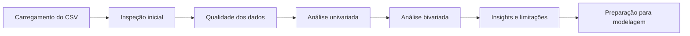

<section class="hero" markdown>

APS Machine Learning • Documentação aberta

# Stroke Prediction EDA

Análise exploratória de dados sobre fatores clínicos e demográficos associados à ocorrência de AVC, com documentação preparada para publicação em GitHub Pages.

[Ver análise](analysis.md){ .md-button .md-button--primary }
[Conhecer o dataset](dataset.md){ .md-button }
[Executar localmente](setup.md){ .md-button }

</section>

## Visão Geral

Este projeto investiga o **Stroke Prediction Dataset**, um conjunto público com registros de pacientes e variáveis como idade, hipertensão, doença cardíaca, glicose média, IMC e tabagismo. O foco desta etapa é entender a estrutura dos dados, identificar limitações e extrair sinais relevantes antes de qualquer modelagem preditiva.

Registros
<strong>5.110</strong>
Pacientes no arquivo original.

Classe positiva
<strong>4,87%</strong>
249 casos de AVC registrados.

Variáveis
<strong>11</strong>
Atributos preditivos mais a variável-alvo.

IMC ausente
<strong>3,93%</strong>
201 registros com `bmi` sem informação.

## Resumo Executivo

| Pergunta | Resposta da EDA |
|---|---|
| Qual é o problema? | Classificação binária da ocorrência de AVC (`stroke`). |
| Qual é o maior desafio? | A base é altamente desbalanceada: a classe positiva representa apenas 4,87% dos registros. |
| Quais variáveis chamam atenção? | Idade, hipertensão, doença cardíaca, glicose média e IMC. |
| O que precisa de cuidado? | Valores ausentes em `bmi`, categoria `Unknown` em tabagismo e avaliação com métricas adequadas para dados desbalanceados. |

## Pipeline da EDA

## Principais Achados

Achado 1

### Idade concentra risco

Pacientes com 60 anos ou mais concentram a maior taxa observada de AVC no dataset, com 13,15% de casos positivos nesse grupo.

Achado 2

### Comorbidades importam

Hipertensão e doença cardíaca aparecem associadas a taxas de AVC bem superiores às dos grupos sem essas condições.

Achado 3

### Métrica exige cuidado

Como a classe positiva é rara, acurácia isolada pode mascarar modelos ruins para detectar pacientes com AVC.

## Critérios de Entrega

**Documentação aberta** 
Site MkDocs pronto para publicação em GitHub Pages.

**Reprodutibilidade** 
Instruções de ambiente, dependências e execução do notebook.

**Clareza analítica** 
Dataset, hipóteses, limitações e achados documentados em páginas separadas.

**Acabamento profissional** 
Tema Material, busca, navegação organizada, cards, tabelas e diagrama de pipeline.

## Autoria

**Carolina Amorim** e **Lara Abduni** 
Projeto de Machine Learning com foco em análise exploratória de dados.
