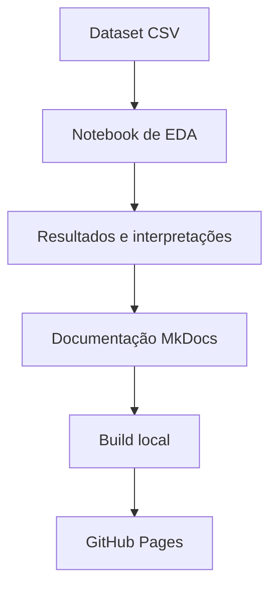

# Arquitetura do Projeto

## Estrutura de Diretórios

```text
StrokePrediction-EDA/
├── docs/
│   ├── assets/
│   │   ├── images/
│   │   └── stylesheets/
│   │       └── extra.css
│   ├── index.md
│   ├── dataset.md
│   ├── analysis.md
│   ├── setup.md
│   ├── project-structure.md
│   └── references.md
├── healthcare-dataset-stroke-data.csv
├── StrokePrediction.ipynb
├── mkdocs.yml
├── README.md
├── scripts/
│   └── generate_docs_figures.py
├── requirements.txt
└── requirements-docs.txt
```

## Componentes

- `StrokePrediction.ipynb`: notebook principal com análise exploratória.
- `healthcare-dataset-stroke-data.csv`: arquivo do dataset.
- `docs/`: documentação estática em Markdown.
- `docs/assets/images/`: gráficos exportados para enriquecer a documentação.
- `mkdocs.yml`: configuração do site MkDocs.
- `docs/assets/stylesheets/extra.css`: ajustes visuais específicos da documentação.
- `scripts/generate_docs_figures.py`: script que gera os gráficos usados na página de análise.
- `requirements.txt`: dependências necessárias para executar a análise.
- `requirements-docs.txt`: dependências necessárias para gerar e publicar a documentação.

## Organização da Documentação

| Página | Papel na entrega |
|---|---|
| `index.md` | Apresentação executiva do projeto e principais achados. |
| `dataset.md` | Fonte, dicionário de dados e pontos de atenção do dataset. |
| `analysis.md` | Resultados da EDA, tabelas-resumo, interpretações e limitações. |
| `setup.md` | Instruções de ambiente, execução local e publicação. |
| `project-structure.md` | Estrutura do repositório e função de cada arquivo. |
| `references.md` | Fontes e bibliotecas utilizadas. |

## Fluxo de Trabalho



## Boas Práticas Aplicadas

- Separação entre análise (`StrokePrediction.ipynb`) e documentação (`docs/`).
- Configuração declarativa do site em `mkdocs.yml`.
- Dependências de análise e documentação em arquivos separados.
- Estrutura preparada para publicação aberta via GitHub Pages.
